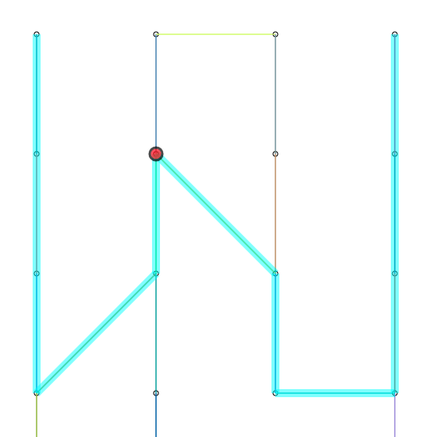

# Trains

## Goals

1.  Create a set of stations
2.  Create a set of lines
3.  Connects stations between different lines
4.  Find the best (shorter) route between A -> B

## Demo

[https://festive-khorana-e1cf6c.netlify.com/](https://festive-khorana-e1cf6c.netlify.com/)
